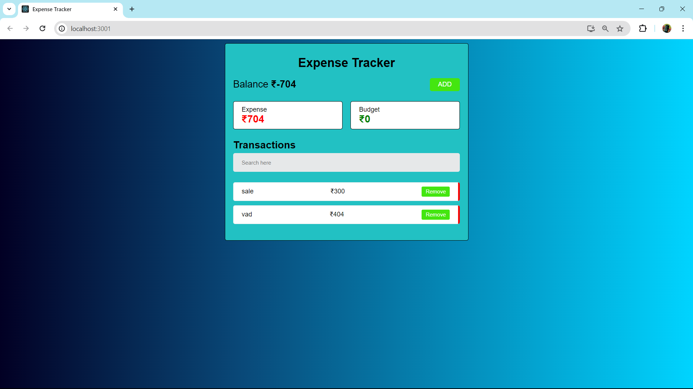

# Expense Tracker App


The **Expense Tracker App** is a web application built using React. It helps users manage and track their expenses, allowing them to add, edit, and delete expenses, while also showing a summary of their spending habits. Users can see their total expenses and the available balance.

## Preview of Final Output
Here's a preview of how the application looks:

  

## Prerequisites and Technologies Used
To work with or develop this project, the following technologies and prerequisites are required:

- **Node.js**: To run the development server and build the React app.
- **React**: The framework used for building the application.
- **JavaScript**: The programming language used in the project.
- **HTML/CSS**: For layout and styling.

## Approach and Functionality
The Expense Tracker App has the following functionalities and follows this approach for implementation:

- **Add, Edit, and Delete Expenses**: Users can add new expenses, edit existing ones, and delete expenses. The application updates in real-time.

- **State Management with React**: The app maintains a list of expenses in its state. By using React hooks like `useState`, the app ensures reactivity and updates the UI when changes occur.

- **Expense Summary and Balance**: The app displays a summary of total expenses and calculates the remaining balance.

- **Component-Based Design**: The app is structured into multiple components, allowing for a modular and maintainable codebase.

## Getting Started
To run the Expense Tracker App locally, follow these steps:

1. **Clone the Repository**: Clone the repository to your local machine.
   ```bash
   git clone https://github.com/Psh09/Expense-Tracker.git
   ```

2. **Install Dependencies**: Navigate to the project folder and install the required dependencies.
   ```bash
   cd expense-tracker
   npm install
   ```

3. **Run the App**: Start the development server to run the app locally.
   ```bash
   npm start
   ```

## Contributing
Contributions to the Expense Tracker App are welcome! If you'd like to contribute, please fork this repository, create a new branch for your changes, and submit a pull request.

## Acknowledgments
- Thanks to all contributors and developers involved in this project.
